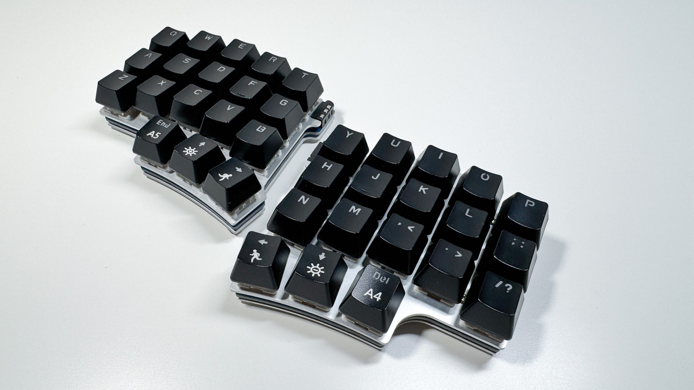

# X.Tips X7S QMK Firmware

QMK firmware files for the X.Tips X7S 36-key split keyboard.

  

## Overview

- Works out of the box with [Vial 0.7.1](https://get.vial.today/download/)
- Full QMK support with 9 layers via VIA/Vial
- RGB LED indicators for each layer
- Split keyboard with 3x5 + 3 thumb keys per half
- USB-C connection

## Hardware Features

- STM32F103 MCU
- Split keyboard communication via USART
- WS2812 RGB LEDs (1 per half)
- Direct pin matrix

## RGB LED Layer Indicators

The RGB LEDs show different colors for each layer as defined in leds.c

## Files Structure

- 

config.h

 - Core configuration (RGB LED settings)
- 

keyboard.json

 - Keyboard layout and pin mapping
- 

via

 - VIA-enabled keymap files
  - keymap.c - Default keymap with 9 layers
  - leds.c - RGB LED layer indicators

## License

This firmware is released under [GPL-2.0-or-later](https://www.gnu.org/licenses/gpl-2.0.html).

## Credits

- Original firmware by zvecr
- VIA compatibility and RGB layer indicators by X.Tips
